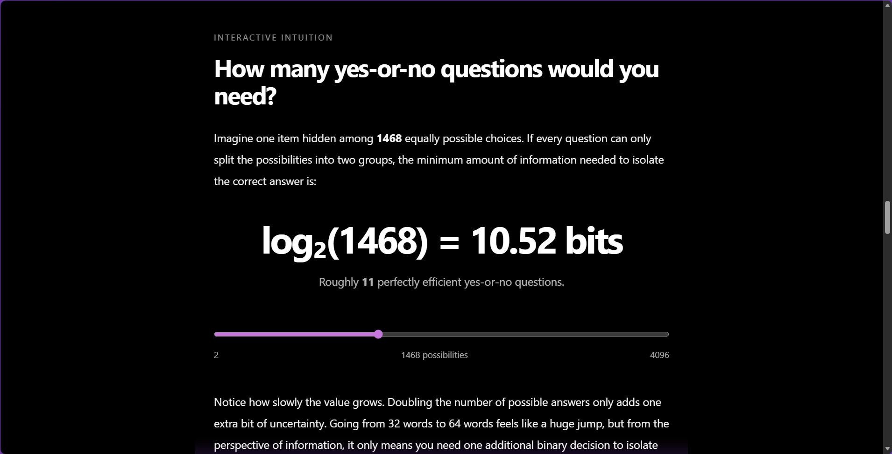
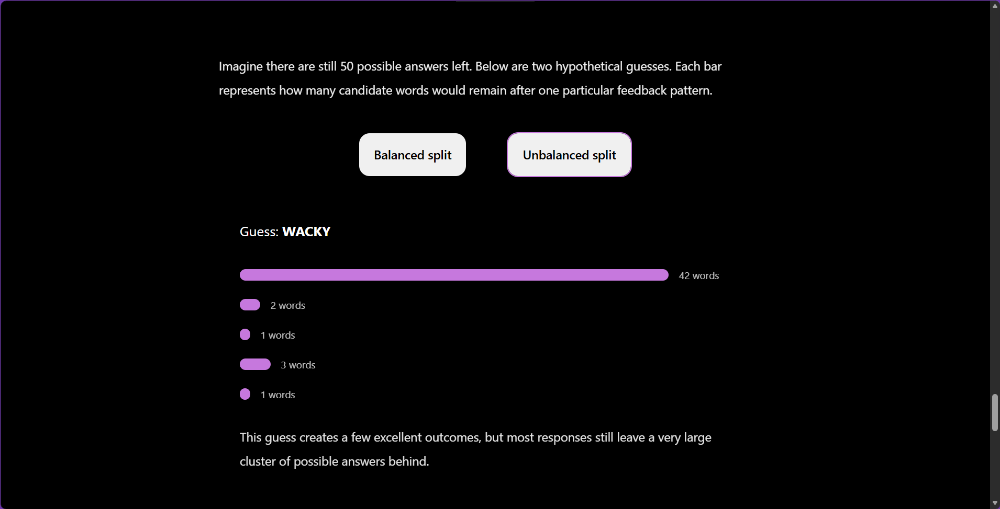
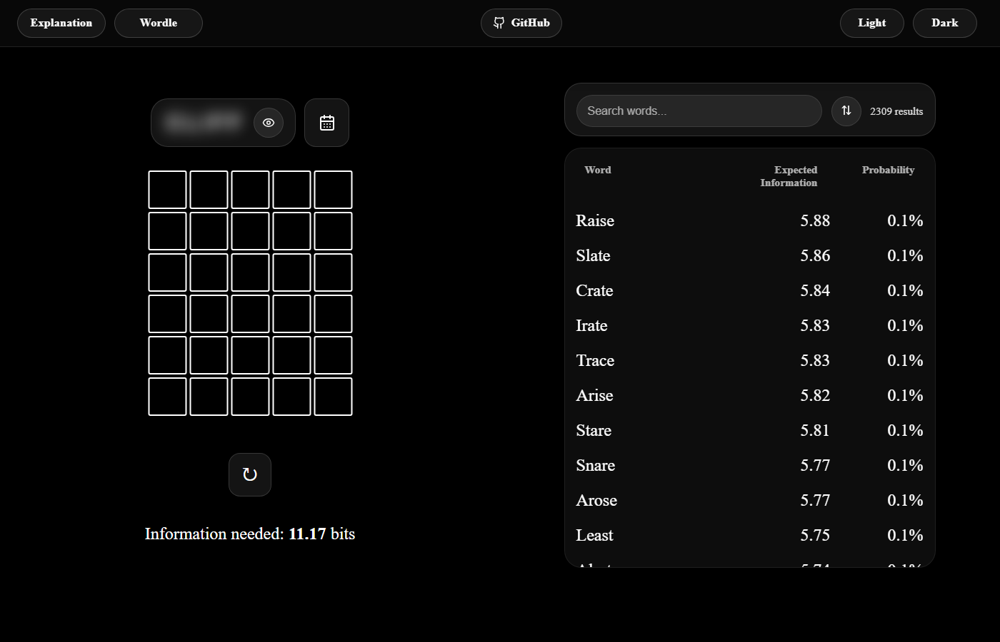

# Wordle Information Theory Visualizer

An interactive website for learning the mathematics and information theory behind optimal Wordle strategy.

This project explores a simple idea:

> Every Wordle guess is a question.

When you make a guess, Wordle responds with information — green, yellow, and gray tiles that reduce uncertainty about the hidden word. Some guesses barely help. Others eliminate thousands of possibilities instantly.

This website uses Wordle as a concrete way to teach ideas from information theory, including entropy, expected information, uncertainty reduction, and optimal guessing strategies.

It combines an interactive explanation with a fully playable Wordle visualizer so users can immediately apply the concepts they learn.

## Live Demo

https://wordle-visualizer.vercel.app/

---

# Features

## Interactive Explanation Mode

A guided explanation that introduces concepts step-by-step through interactive examples and experiments.

<p align="center">
  
</p>

<p align="center">
  
</p>

Topics include:

- Wordle feedback mechanics
- Candidate filtering
- Information as uncertainty reduction
- Expected information gain
- Shannon entropy
- Why some guesses are more informative than others

The explanation is designed more like an interactive essay than traditional documentation.

---

## Playable Wordle Mode

<p align="center">
  
</p>

A complete Wordle interface with:

- Keyboard input support
- Colored feedback rendering
- Real-time state updates
- Guess validation
- Candidate tracking

---

## Entropy-Based Guess Visualizer

For every possible guess, the app:

1. Simulates feedback against every remaining answer
2. Groups outcomes by feedback pattern
3. Measures how effectively each guess splits the search space
4. Computes expected information using Shannon entropy
5. Ranks guesses from most informative to least informative

This means the solver is not simply looking for common letters — it is actively trying to maximize expected information gain.

---

# Project Structure

```txt
app
├── layout.tsx
├── page.tsx
└── wordle
    └── page.tsx

src
├── components
│   ├── explanation
│   │   ├── Entropy.jsx
│   │   ├── ExpectedInformation.jsx
│   │   ├── Experiment.jsx
│   │   ├── Explanation.jsx
│   │   └── Introduction.jsx
│   │
│   ├── AppShell.jsx
│   ├── Board.jsx
│   ├── Header.jsx
│   ├── Visualizer.jsx
│   └── Wordle.jsx
│
├── data
│   ├── allWords.js
│   └── baseExpectedInfo.js
│
├── logic
│   ├── reducer.js
│   └── wordle.js
│
├── styles
│   ├── App.css
│   ├── Explanation.css
│   └── Wordle.css
│
├── CONSTANTS.js
└── index.css
```

---

# How It Works

The app treats Wordle as an information optimization problem.

After each guess:

- The remaining valid candidate words are filtered
- Every possible next guess is simulated
- Feedback patterns are generated
- Outcome probabilities are calculated
- Expected information gain is measured using entropy

The best guesses are the ones expected to reduce uncertainty the most.

Mathematically, the project is heavily inspired by Claude Shannon's work on information theory.

---

# Tech Stack

- React
- Next.js (App Router)
- JavaScript
- CSS
- Reducer-based state management

---

# Running Locally

Clone the repository and install dependencies:

```bash
npm install
```

Start the development server:

```bash
npm run dev
```

Then open the local URL shown in the terminal.

---

# Why I Made This

Most Wordle solvers focus only on giving the "best" word.

I wanted to build something that explains *why* certain guesses are strong and how information theory naturally emerges from the game itself.

The goal of this project is not just solving Wordle efficiently, but making entropy and information gain feel intuitive through interaction and experimentation.

---

# Future Ideas

Some possible future additions:

- Animated entropy demonstrations
- Performance optimizations
- Mobile UX improvements

---

# License

This project is open source and available under the MIT License.
